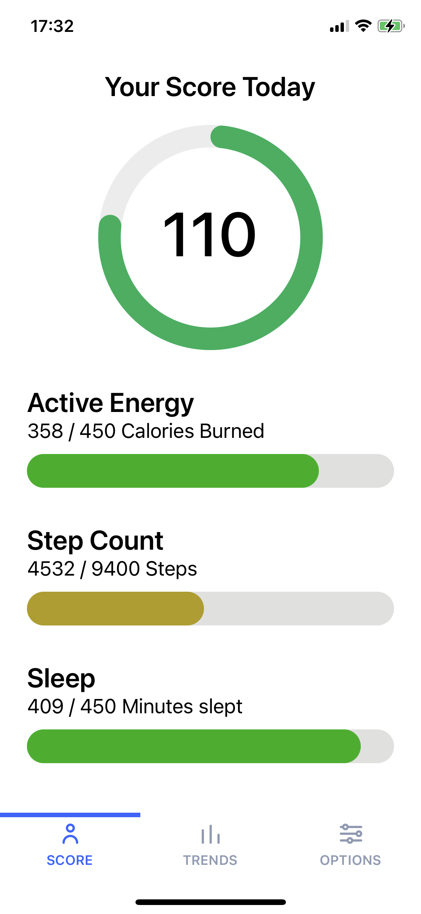
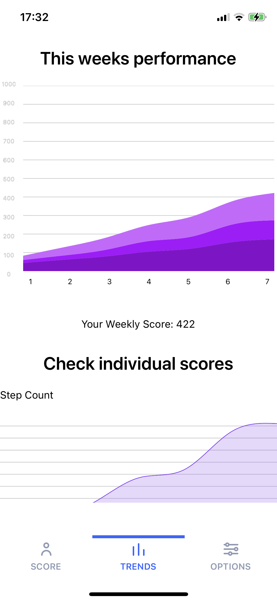
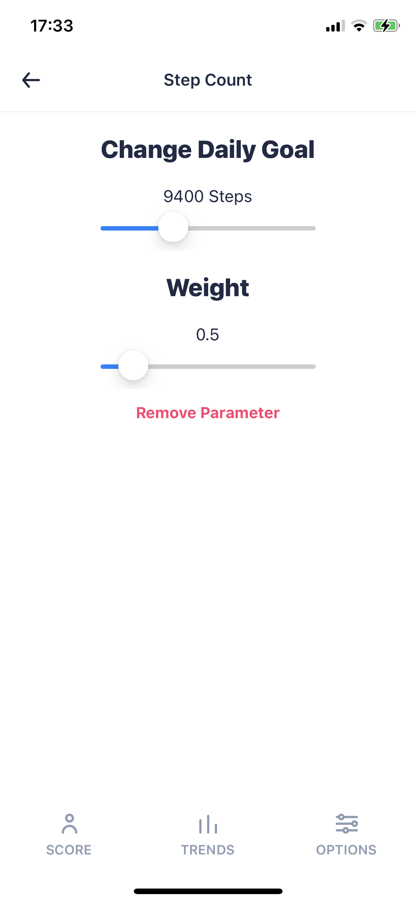

# HealthProject
Health Project is a React Native Dashboard for Health data.
It connects to Apple Health Kit via [React Native Health](https://github.com/agencyenterprise/react-native-health) and displays a daily score based on the users' goals.
* Choose datasets to monitor like `Mindful Minutes`or `Calories Burned`
* Set personal priorities by changing how different datasets should influence the score (`Weight`)
* Monitor your progress over the last seven days and strive for 1000 points per week (140 per day)

Home Screen           |  Trends Screen | Options Screen
:-------------------------:|:-------------------------: |:-------------------------:
  |   | 

# Stack
* React Native
* [React Native Health](https://github.com/agencyenterprise/react-native-health) (HealthKit)
* [React Native SVG Charts](https://github.com/JesperLekland/react-native-svg-charts) (Graphs)
* [UI Kitten](https://akveo.github.io/react-native-ui-kitten/) (UI)

# Setup
If you want to test the App on your iPhone, you will have to run it through Xcode on a Mac.
* Download the repo on your local hard drive
* Connect your iPhone to your Mac
* Open the iOS Folder in xCode and select your phone. Then click 'Build'

